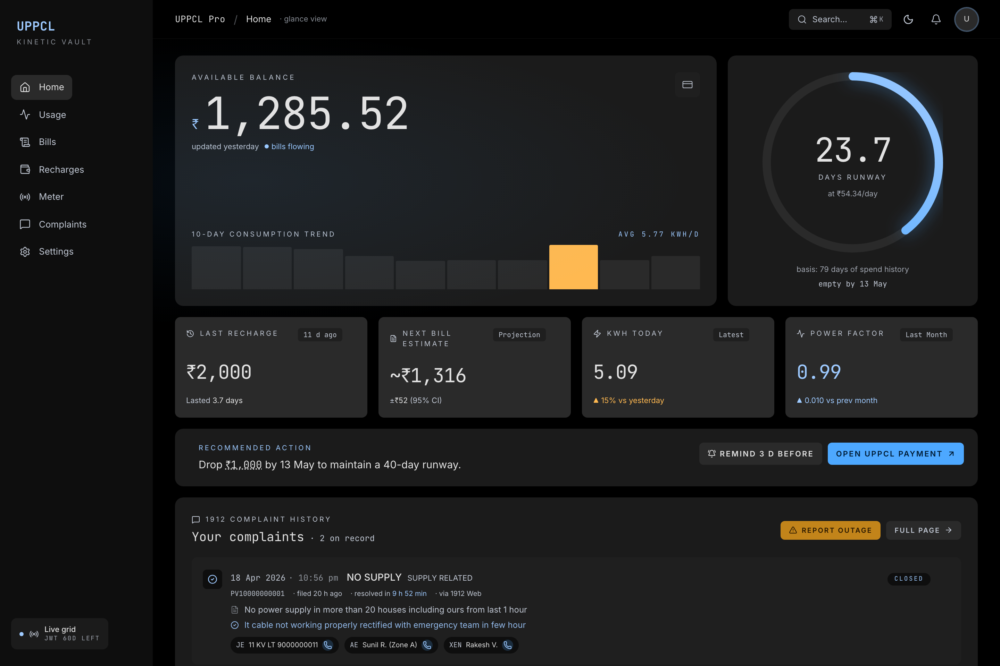
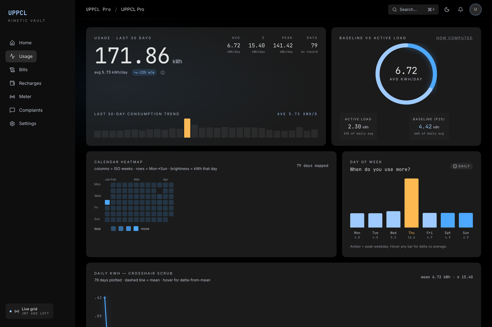
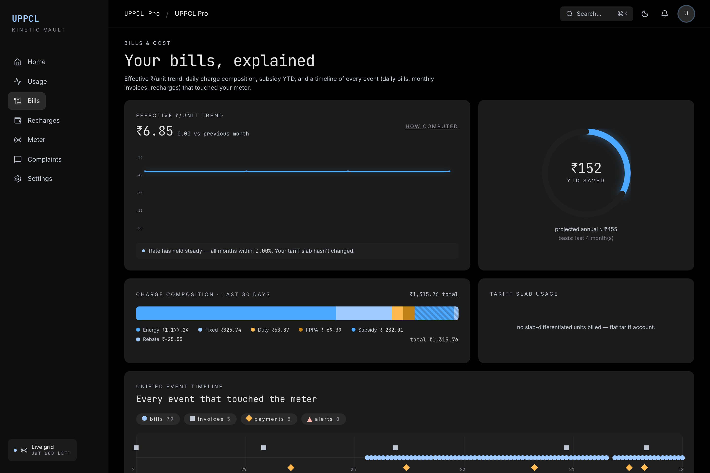
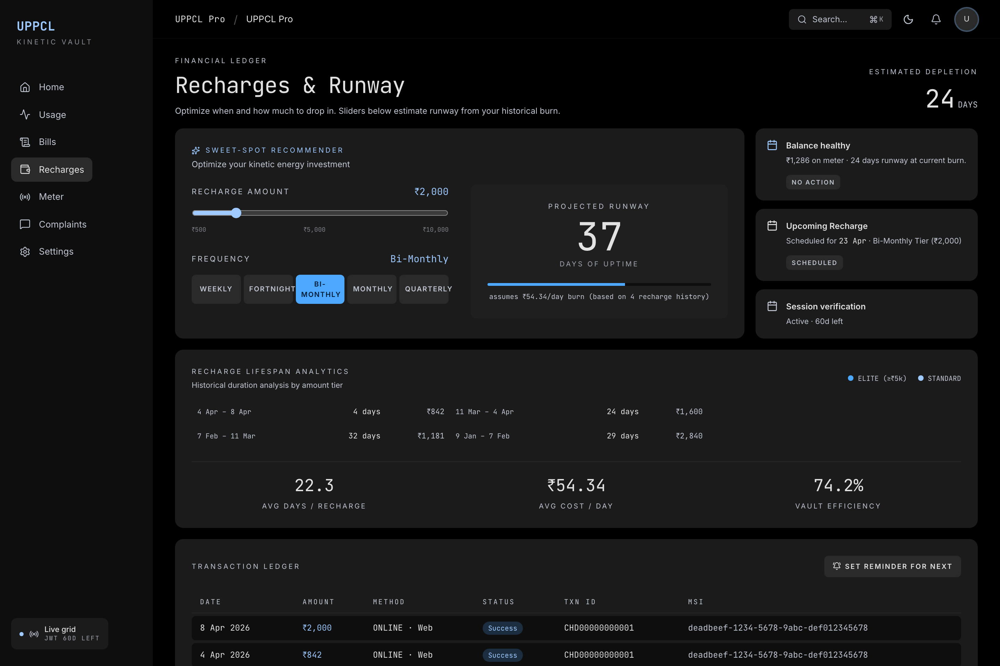
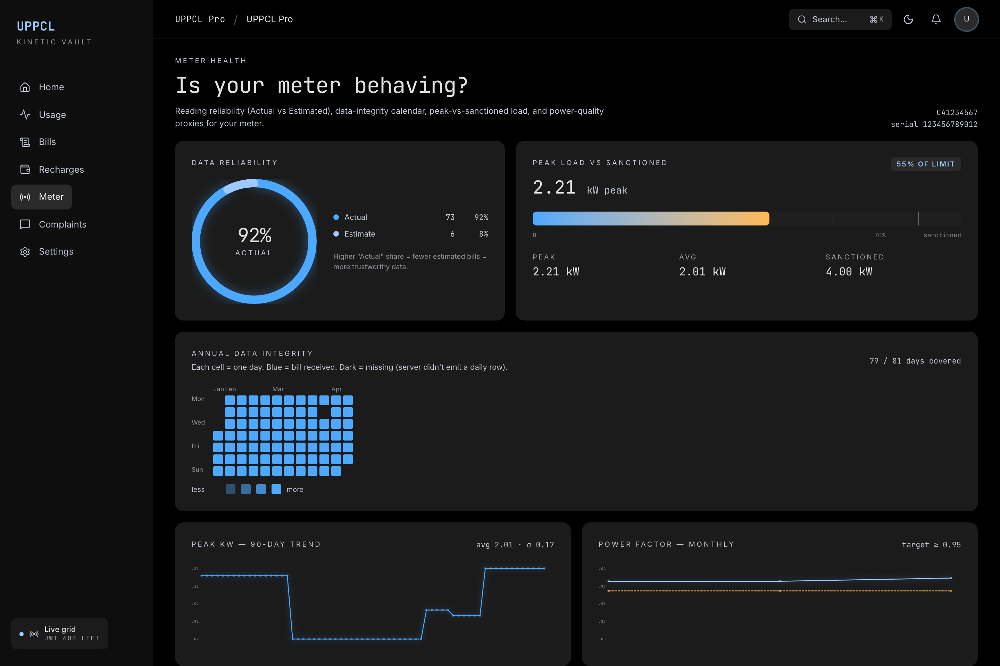
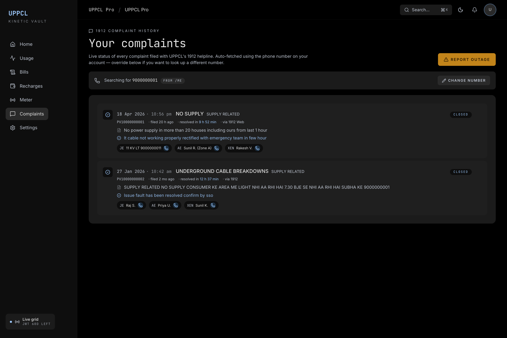
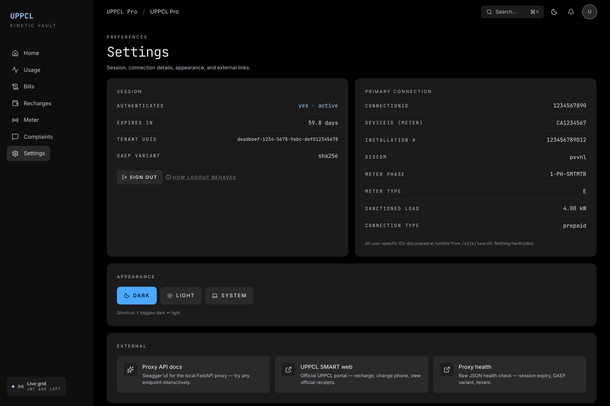
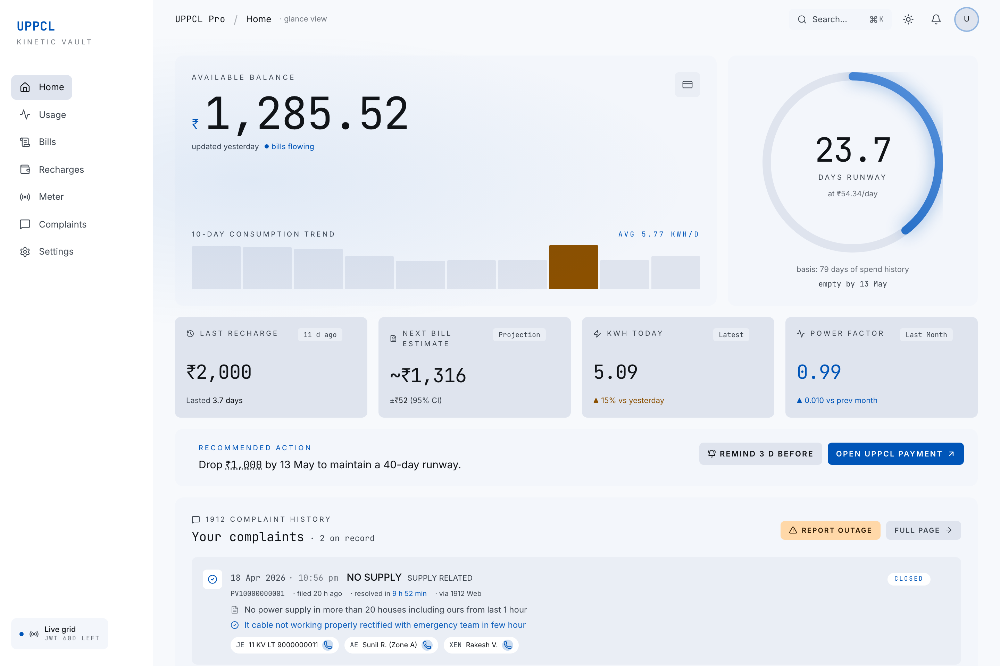
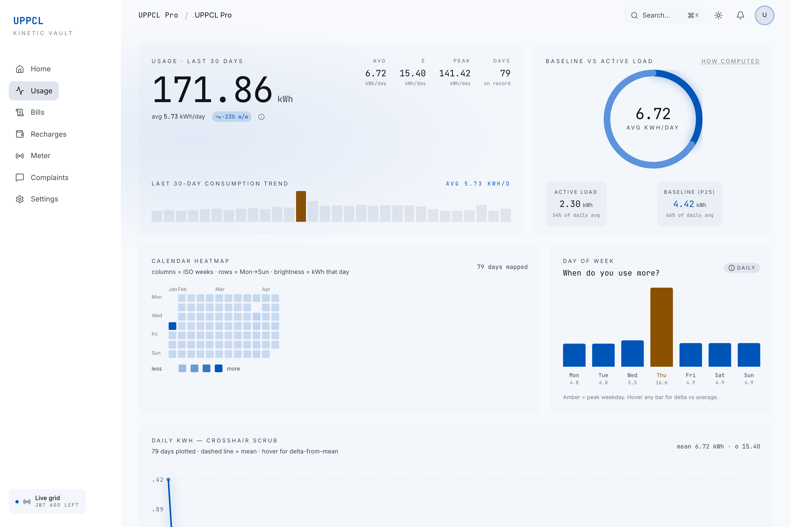
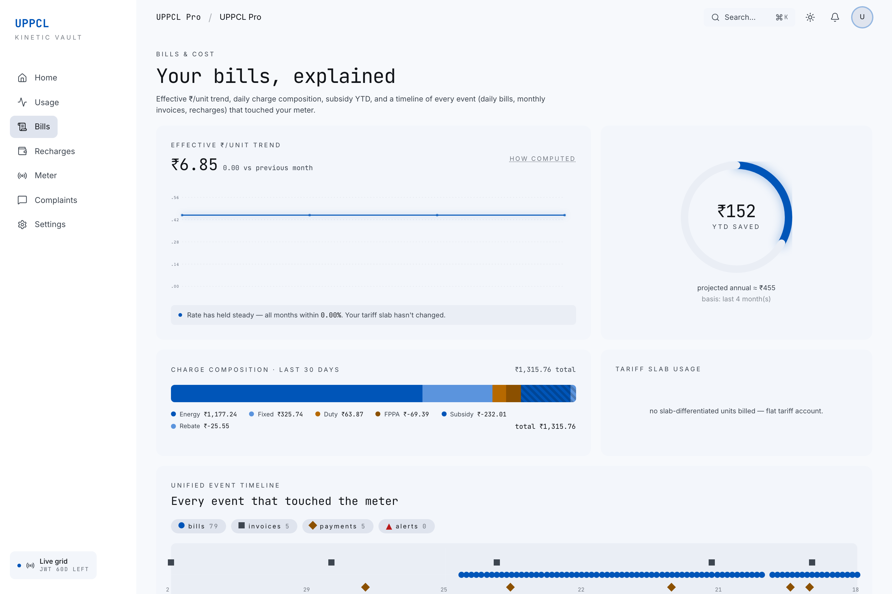

<div align="center">

# ⚡ UPPCL Pro — *Kinetic Vault*

### *Your prepaid meter, finally making sense.*

A self-hosted analytics dashboard for **UPPCL SMART** prepaid electricity meters.
Dark-first. Reverse-engineered. Runs on your laptop, a VPS, or a Raspberry Pi Zero 2.

<p>
  <a href="#features"></a>
  <a href="#raspberry-pi-zero-2"></a>
  <a href="#reverse-engineering-notes"></a>
  <a href="LICENSE"></a>
</p>

[Features](#features) · [Quickstart](#quickstart) · [Raspberry Pi](#raspberry-pi-zero-2) · [Architecture](#architecture) · [API](#api-reference) · [Reverse engineering](#reverse-engineering-notes)

<picture>
  <source media="(prefers-color-scheme: dark)"  srcset="docs/screenshots/home-dark.png">
  <source media="(prefers-color-scheme: light)" srcset="docs/screenshots/home-light.png">
  
</picture>

<sub><em>Follows your GitHub theme — dark shown above, light on the light site.</em></sub>

</div>

---

> ### 🔋 Scope & compatibility — read first
>
> UPPCL Pro is specifically for **UPPCL SMART prepaid smart meters** (the ones on the Jio-hosted `uppcl.sem.jio.com` / Android "UPPCL SMART" app). It is **not** for postpaid connections or the older `uppclonline.com` flow.
>
> This release is **only tested end-to-end on PVVNL** (Paschimanchal Vidyut Vitran Nigam Limited — the western UP DISCOM covering Ghaziabad, Noida, Agra, Aligarh, Saharanpur, and surrounding districts). The other four UPPCL DISCOMs — **MVVNL · PuVVNL · DVVNL · KESCo** — share the same upstream API and *should* work identically since every user-specific identifier is discovered at runtime from `/site/search` with zero hardcoded tenant values. They're untested on live accounts; if you try one, [file an issue](https://github.com/Harry-kp/uppcl-pro/issues) and I'll mark it verified in the table below.
>
> | DISCOM | Region | Status |
> |---|---|---|
> | **PVVNL** | West UP | ✅ tested end-to-end |
> | MVVNL | Central UP | 🟡 same API, unverified |
> | PuVVNL | East UP | 🟡 same API, unverified |
> | DVVNL | South UP | 🟡 same API, unverified |
> | KESCo | Kanpur | 🟡 same API, unverified |

## Why

The official [UPPCL SMART web portal](https://uppcl.sem.jio.com/uppclsmart/) (built by Jio) is functional but stops at "today's balance." If you want to know:

- *"Will my balance last till Friday at current burn?"*
- *"Did yesterday's spike come from the AC or a slab-crossing?"*
- *"What's my real per-unit rate including FPPA + duty − subsidy?"*
- *"How long did my last ₹2,000 recharge actually last?"*
- *"Which weekday do we use the most power?"*
- *"What's the status of that 1912 complaint I filed last week?"*

— you're out of luck. This project reverse-engineers UPPCL's encrypted API, proxies it as plain JSON on your own machine, and wraps it in a dense analytics dashboard.

**Everything runs locally. Your meter data never leaves your network.**

## Features

### The dashboard
- **Live balance** with automatic fallback: tries live meter query → latest daily bill → billing-system outstanding. Always shows a trustworthy number with a `source` tag.
- **Runway forecast** — fitness-ring gauge showing days remaining at current burn rate, plus ETA date.
- **Anomaly detection** — flags days where consumption is > 1.5σ above the 30-day average, with a side panel explaining the math.
- **Day × calendar heatmap** — GitHub-style, one year of per-day kWh intensity.
- **Day-of-week pattern** — answers "when do we use more?" without hourly data (upstream only emits daily totals).
- **Cost breakdown** — effective ₹/unit trend, stacked charge composition (energy / fixed / duty / FPPA / subsidy / rebate), tariff slab usage, subsidy YTD.
- **Unified event timeline** — every daily bill, monthly invoice, and recharge on one filterable axis, click-to-drill-in.
- **Recharge sweet-spot** — interactive sliders recommend amount × frequency for a target runway, based on your historical burn.
- **Meter health** — reading reliability donut (Actual vs Estimated), 365-day data-gap calendar, peak-vs-sanctioned-load gauge, power-factor trend.
- **1912 complaint history** — live status of every complaint filed from your phone, with JE / AE / XEN officer chain + one-tap call buttons. One-click "Report outage" side panel with pre-filled complaint text.

### Under the hood
- **Local FastAPI proxy** on :8000 that handles ALTCHA proof-of-work, RSA-OAEP + AES-256-GCM envelope encryption, 60-day JWT auth.
- **Next.js 16 dashboard** on :3000 with Tailwind v4, SWR, command palette (⌘K), keyboard shortcuts (`g h / u / b / r / m / c / s`).
- **Dark + light themes** based on MD3 tonal surfaces with chart colours that auto-switch.
- **Zero user-specific code** — every ID (`connectionId`, `deviceId`, `tenantId`) is discovered at runtime from `/site/search`. Nothing is hardcoded per user.
- **OpenAPI 3.1 schema** — browse all 23 endpoints without cloning: **[Swagger UI](https://harry-kp.github.io/uppcl-pro/swagger.html)** · **[ReDoc](https://harry-kp.github.io/uppcl-pro/api.html)**. Also live at `/docs` and `/redoc` on a running proxy.

## Quickstart

```bash
git clone https://github.com/Harry-kp/uppcl-pro.git
cd uppcl-pro
make setup       # installs Python + Node deps
make dev         # starts proxy (:8000) and dashboard (:3000)

# first-time login:
curl -X POST localhost:8000/auth/login \
  -H 'content-type: application/json' \
  -d '{"username":"<your UPPCL username>","password":"<your password>"}'

open http://localhost:3000
```

Prereqs:
- **Python 3.10+** (for the proxy)
- **Node 20+** or **Bun 1.1+** (for the dashboard)
- A UPPCL SMART account (username = phone or account number)

You can also run only the proxy (if you just want the JSON API via Swagger / curl) — skip the `web/` step entirely. Once the proxy is up, browse to `http://localhost:8000/docs` for the interactive Swagger UI.

### 🤖 Guided setup via Claude Code

If you use [Claude Code](https://claude.com/claude-code), two project-level skills ship with this repo and auto-discover on clone — no install step:

| Slash command | What it does |
|---|---|
| `/setup` | Checks toolchain, installs Python + dashboard deps, optionally sets up Playwright. Reports what's already done vs. missing before touching anything. |
| `/first-login` | Starts the stack, walks you through logging in to UPPCL, smoke-tests `/dashboard` + `/sites`, surfaces the Swagger UI. Handles specific 401 / 500 / 502 error paths. |

Just open the repo in Claude Code and type `/setup`. The skills live in [`.claude/skills/`](.claude/skills/) — feel free to edit, extend, or lift them for your own projects.

## Raspberry Pi Zero 2

The Pi Zero 2 W is 512 MB RAM / quad-core ARM64 @ 1 GHz. The Python proxy is comfortable; the Next.js **build** would OOM. Solution: build the dashboard once on your laptop, ship the static output to the Pi, and run only the Python proxy + a static file server.

Caddy binds to `:1912` (UPPCL's own helpline number, memorable, outside the usual collision zone) so the stack drops onto a Pi that's already running Pi-hole / Portainer / Homebridge without fighting for ports.

Step-by-step guide: [`docs/PI_DEPLOY.md`](docs/PI_DEPLOY.md). TL;DR:

```bash
# on the pi — one-time
sudo apt install -y python3-venv python3-pip caddy rsync

# on your laptop
make pi-deploy PI=<user>@<pi-ip>        # build + rsync + remote setup in one

# then open
# → http://<pi-ip>:1912/
```

Optional, if you also run Pi-hole on the same Pi — one line gives you `http://uppcl.lan:1912/`:

```bash
sudo pihole-FTL --config dns.hosts '[ "<pi-ip> uppcl.lan" ]'
sudo systemctl restart pihole-FTL
```

(Don't use `.local` — it's mDNS, which most clients route around Pi-hole. `.lan` / `.home.arpa` / `.box` are safe.)

Expected resource usage on a Pi Zero 2: **~60 MB RAM proxy + ~40 MB Caddy, ~3% CPU idle.**

## Architecture

```
┌─────────────────────────┐   plaintext JSON   ┌──────────────────────┐  encrypted  ┌─────────────┐
│ Dashboard (Next.js)     │◄──────────────────►│ Proxy (FastAPI)      │◄───────────►│ UPPCL SMART │
│ :3000 — SSR + SWR       │                    │ :8000                │             │ (Jio)       │
└─────────────────────────┘                    │                      │             └─────────────┘
                                               │ • ALTCHA captcha     │             ┌─────────────┐
┌─────────────────────────┐   plaintext JSON   │ • RSA-OAEP + AES-GCM │  encrypted  │ Appsavy     │
│ Swagger UI / curl / …   │◄──────────────────►│ • JWT caching        │◄───────────►│ (1912 CRM)  │
│                         │                    │ • Tenant discovery   │             └─────────────┘
└─────────────────────────┘                    └──────────────────────┘
```

Key files:

```
uppcl_api.py                  FastAPI proxy — everything upstream + CORS for the dashboard
appsavy.py                    Standalone client for the UPPCL 1912 complaint portal
docs/openapi.json             Auto-generated OpenAPI 3.1 schema (served live at /openapi.json)
web/                          Next.js 16 dashboard (app router, Tailwind v4, SWR)
  src/app/                    Pages
  src/components/             Shared UI (Sidebar, Topbar, OutagePanel, ComplaintsSection...)
  src/components/viz/         Custom SVG charts (no recharts/tremor)
  src/lib/                    API client, stats, utils, chart-colour tokens
docs/                         Deployment guide, architecture notes, screenshots
deploy/                       systemd + Caddy configs for Pi / VPS
scripts/                      Automation (screenshots, deploy)
```

## API reference

All proxy routes return plain JSON.

- **🌐 Swagger UI** (hosted): **[harry-kp.github.io/uppcl-pro/swagger.html](https://harry-kp.github.io/uppcl-pro/swagger.html)** — identical to `/docs` on a running proxy. Schema browsing works without setup; "Try it out" requires the proxy running locally.
- **🌐 ReDoc** (hosted): **[harry-kp.github.io/uppcl-pro/api.html](https://harry-kp.github.io/uppcl-pro/api.html)** — clean three-panel reference, identical to `/redoc` on a running proxy.
- **🧪 Interactive (local)**: start the proxy (`make dev-proxy`) and open `http://localhost:8000/docs` — Swagger UI with full try-it-out against a live proxy.
- **📄 Raw schema**: [`docs/openapi.json`](docs/openapi.json) in the repo, or `/openapi.json` on a running proxy.

| Route | What it does |
|---|---|
| `POST /auth/login` | Password → JWT (cached 60 d on disk) |
| `GET /health` | Session state + JWT expiry |
| `GET /sites` | All connections on the account |
| `GET /me` | User profile |
| `GET /balance` | Live balance with auto-fallback chain |
| `GET /balance/outstanding` | Billing-system outstanding amount |
| `GET /bills?days=N` | Per-day bill history |
| `GET /bills/history?limit=N` | Monthly invoices |
| `GET /payments?limit=N` | Recharge history |
| `GET /consumption?days=N` | Daily kWh series |
| `GET /history/yearly?year=Y` | Monthly rollups incl. power factor |
| `GET /dashboard` | One-shot composite for the Home page |
| `GET /complaints/my?phone=N` | 1912 complaint history, full-detail, newest-first |
| `GET /complaints/detail?data_id=X` | Single complaint by Appsavy internal ID |
| `GET /complaints/list?phone=N` | Lightweight list (no detail fan-out) |
| `POST /debug/raw` | Escape hatch — encrypt + forward any upstream path |

## Reverse engineering notes

This project is a deep dive into two UPPCL-facing backends. If you're curious about how it all works, start with [`CLAUDE.md`](CLAUDE.md) — it documents the full investigation, including the quirks that cost the most time.

Highlights:

### UPPCL SMART (`uppcl.sem.jio.com`)
- Hybrid RSA-OAEP-SHA256 + AES-256-GCM request encryption. Falls back to OAEP-SHA1 if the server rejects SHA-256.
- ALTCHA proof-of-work captcha, brute-forced in <10 ms.
- JWT is sent in a `token` HTTP header — HAR exports sanitize auth headers, so at first glance it looked like nothing was being sent. Documented so nobody else wastes a day.
- Field-name quirks worth remembering:
  - `/payment/v2/search` wants `consumer_id` (snake_case). The server's 409 says "`connectionID` missing" which is a lie.
  - `/eventsummary/aggregate` needs ISO-8601 dates with the explicit `+05:30` IST offset. Anything else returns `[object Object]`.
  - `/site/prepaidBalance` returns empty `data` for some accounts regardless of body shape — the `/balance` route chains through `outstandingBalance` + latest bill to always return *something*.

### Appsavy (`appsavy.com`) — UPPCL 1912 complaint portal
- 5 encrypted request headers (`appsavylogin`, `formid`, `roleid`, `sourcetype`, `token`) all AES-CBC-128 with key=IV=ASCII `"8080808080808080"` (literal — not a typo).
- Anonymous session bootstrap: `GET /coreapps/UI/Anonymous?PROJECTID=119&FORMID={form}` sets session cookies then redirects to the form. No login required.
- `GetRelationalDataA` endpoint is a generic "run these N AC queries for this parent ID" — we use it for both the complaint-list view (AC 30065) and the detail view (39 ACs covering status, officer chain, closing remarks, etc.).

## Security

- **Nothing runs in the cloud.** The dashboard + proxy are on your machine (or Pi). No telemetry, no phoning home.
- **Credentials stay local.** Username + password are sent only to the UPPCL SMART login endpoint over HTTPS. The proxy never logs or persists them; after login only the JWT is cached.
- **Gitignored paths:** `.env`, `uppcl_session.json`, `*.har`, `web/node_modules`, `web/.next`, `web/out`, `venv`, `__pycache__`.
- **Upstream credentials (API key + tenant UUID)** are not user-specific — they're the values baked into UPPCL's public SPA. If Jio rotates them, bump the `_BOOTSTRAP_API_KEY` / `_BOOTSTRAP_TENANT` constants in `uppcl_api.py` or override via env.
- **Soft logout warning:** UPPCL's `/auth/logout` only invalidates the server-side session record. The JWT itself keeps working until its `expires` timestamp. If you leak your `uppcl_session.json`, change your UPPCL password.

Report security issues privately — see [`SECURITY.md`](SECURITY.md).

## Screenshots

<table>
<tr>
<td width="50%">
<picture>
  <source media="(prefers-color-scheme: dark)"  srcset="docs/screenshots/analytics-dark.png">
  <source media="(prefers-color-scheme: light)" srcset="docs/screenshots/analytics-light.png">
  
</picture>
<p align="center"><strong>Usage analytics</strong><br><sub>Anomaly detection · calendar heatmap · day-of-week pattern · 7/30-day rolling means</sub></p>
</td>
<td width="50%">
<picture>
  <source media="(prefers-color-scheme: dark)"  srcset="docs/screenshots/ledger-dark.png">
  <source media="(prefers-color-scheme: light)" srcset="docs/screenshots/ledger-light.png">
  
</picture>
<p align="center"><strong>Bills &amp; cost</strong><br><sub>Effective ₹/unit trend · charge composition · YTD subsidy · event timeline</sub></p>
</td>
</tr>
<tr>
<td width="50%">
<picture>
  <source media="(prefers-color-scheme: dark)"  srcset="docs/screenshots/recharges-dark.png">
  <source media="(prefers-color-scheme: light)" srcset="docs/screenshots/recharges-light.png">
  
</picture>
<p align="center"><strong>Recharges &amp; runway</strong><br><sub>Sweet-spot recommender · lifespan analytics · next-recharge planner</sub></p>
</td>
<td width="50%">
<picture>
  <source media="(prefers-color-scheme: dark)"  srcset="docs/screenshots/meter-dark.png">
  <source media="(prefers-color-scheme: light)" srcset="docs/screenshots/meter-light.png">
  
</picture>
<p align="center"><strong>Meter health</strong><br><sub>Reading reliability · 365-day data-gap calendar · peak-vs-sanctioned load · power factor</sub></p>
</td>
</tr>
<tr>
<td width="50%">
<picture>
  <source media="(prefers-color-scheme: dark)"  srcset="docs/screenshots/complaints-dark.png">
  <source media="(prefers-color-scheme: light)" srcset="docs/screenshots/complaints-light.png">
  
</picture>
<p align="center"><strong>1912 complaints</strong><br><sub>Live status · JE/AE/XEN officer chain · one-tap call · report-outage panel</sub></p>
</td>
<td width="50%">
<picture>
  <source media="(prefers-color-scheme: dark)"  srcset="docs/screenshots/settings-dark.png">
  <source media="(prefers-color-scheme: light)" srcset="docs/screenshots/settings-light.png">
  
</picture>
<p align="center"><strong>Settings</strong><br><sub>Theme · notifications · session management · data export</sub></p>
</td>
</tr>
</table>

<details>
<summary><strong>Compare dark vs light side-by-side</strong></summary>
<br>
<table>
<tr><td width="50%" align="center"><strong>Dark — Kinetic Vault</strong></td><td width="50%" align="center"><strong>Light — Sunlit Vault</strong></td></tr>
<tr>
<td></td>
<td></td>
</tr>
<tr>
<td></td>
<td></td>
</tr>
<tr>
<td></td>
<td></td>
</tr>
</table>
</details>

---

<sub>Screenshots are auto-generated by [`scripts/capture_screenshots.py`](scripts/capture_screenshots.py) — headless Playwright, 2× DPI, PII redacted via [`scripts/redactions.js`](scripts/redactions.js) using values from <code>scripts/pii.json</code> (gitignored; copy from <a href="scripts/pii.sample.json"><code>pii.sample.json</code></a>). Regenerate locally with <code>make screenshots</code>. Full gallery in [`docs/screenshots/`](docs/screenshots/).</sub>

## Contributing

See [`CONTRIBUTING.md`](CONTRIBUTING.md). TL;DR: fork, branch, send a PR — no CLA, no ceremony.

**Wanted**: DISCOM-specific verification. If you're on MVVNL / PuVVNL / DVVNL / KESCo, run `make dev` + log in. If `/sites` / `/balance` / `/dashboard` all return real data, [open a verification issue](https://github.com/Harry-kp/uppcl-pro/issues) with your DISCOM name — I'll flip its row in the compatibility table to ✅. No code needed; every per-user value is discovered at runtime, so cross-DISCOM support should just be a matter of confirming.

If you want to add support for a DISCOM *outside* UPPCL entirely (e.g. BESCOM, TSNPDCL, MSEDCL — anyone also on Jio's white-labelled SMART stack), the extension point is `uppcl_api.py::UPPCLClient` plus an `appsavy.py`-equivalent for their complaint portal. Would love the PR.

## Roadmap

- [ ] One-click complaint submission from the Vault (already reverse-engineered, gated behind a confirm to avoid accidental real complaints).
- [ ] Multi-connection portfolio view for landlords / property managers.
- [ ] PWA + push notifications (low balance, runway alert).
- [ ] Public API tier (API key-authed) so power users can hook this into Home Assistant / Grafana.
- [ ] iOS / Android widgets via a thin wrapper around the proxy.

## Acknowledgments

- Initial UI direction from [Stitch by Google AI](https://stitch.withgoogle.com/) — the MD3 tonal-surface palette and motion vocabulary this dashboard iterates on were generated there first.
- [Linear](https://linear.app) / [Plane](https://plane.so) / [Grafana](https://grafana.com) / [Monarch Money](https://monarchmoney.com) for UX inspiration.
- Every HAR capture, 409 error, and hex-bytes comparison it took to crack this. 🫡

## License

[MIT](LICENSE) — with an explicit disclaimer that this is **not affiliated with, endorsed by, or connected to** Uttar Pradesh Power Corporation Limited (UPPCL), any of its DISCOMs (PVVNL / MVVNL / PuVVNL / DVVNL / KESCo), or Reliance Jio. All product names, trademarks, and registered trademarks belong to their respective owners.

---

<div align="center">

<sub>**UPPCL Pro** · Kinetic Vault · Built for the prepaid meter on your wall · v1.0</sub>

</div>
