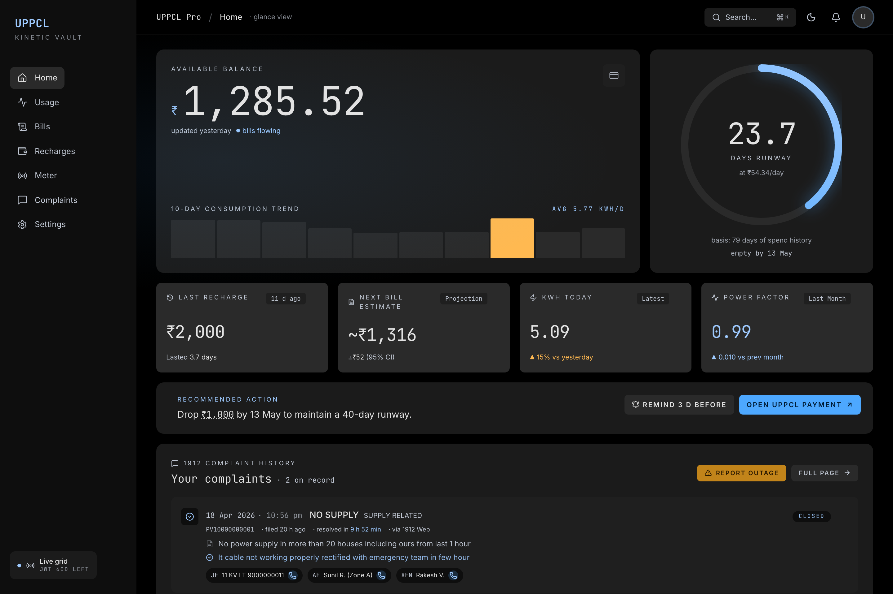
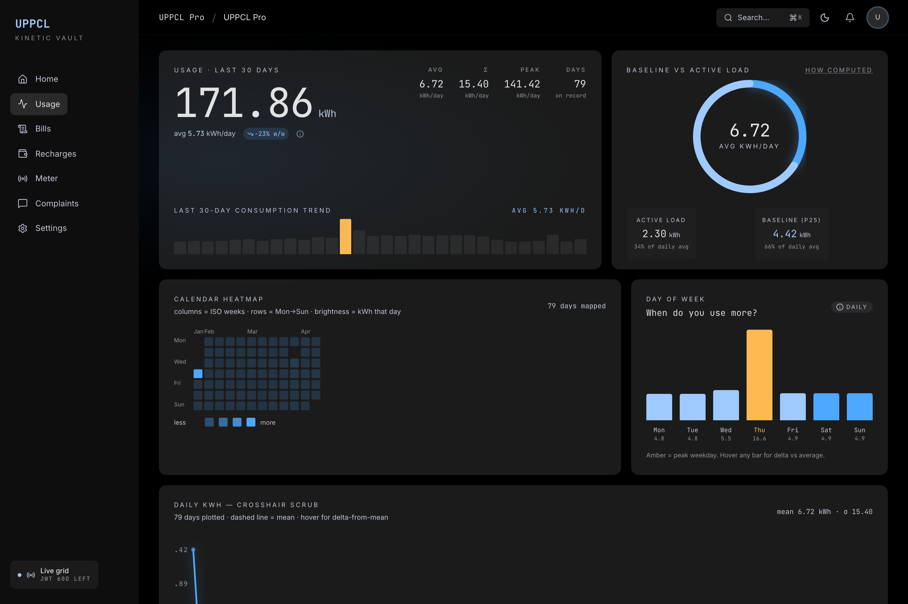
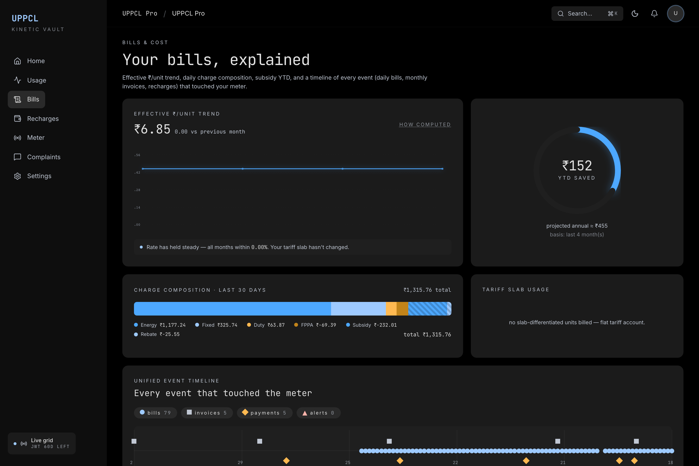
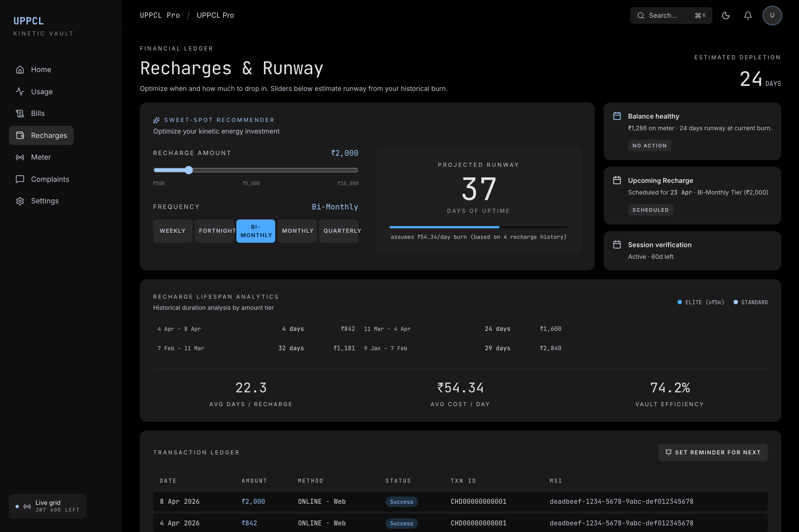
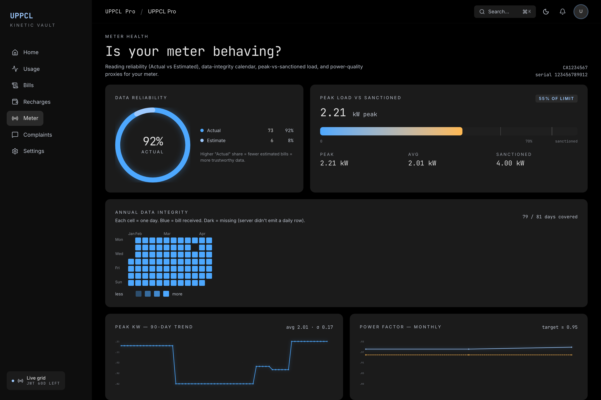
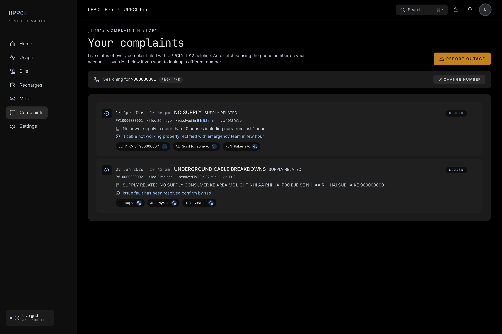

<div align="center">

# UPPCL Pro

**Your UPPCL smart meter, finally making sense.**

Analytics dashboard for UPPCL SMART electricity meters — prepaid *and* postpaid.<br>
Balance &amp; runway, monthly bills with one-tap official PDFs, daily usage &amp; cost, power-quality and carbon insights.

<br>

[**Try it**](https://uppcl-pro.vercel.app) · [Screenshots](#screenshots) · [Self-host](#self-host) · [How it works](#how-it-works)

<br>

<a href="https://uppcl-pro.vercel.app"></a>
<a href="#privacy"></a>
<a href="LICENSE"></a>

</div>

<br>
<picture>
  <source media="(prefers-color-scheme: dark)"  srcset="docs/screenshots/home-dark.png">
  <source media="(prefers-color-scheme: light)" srcset="docs/screenshots/home-light.png">
  
</picture>
## What you get

The dashboard reshapes by meter type — prepaid keeps the balance + runway view; postpaid swaps in amount-due, bill-cycle and projection.

| | |
|---|---|
| **Balance & bills** | Prepaid: live balance, days-until-empty runway, and a recharge recommender. Postpaid: amount due, bill-cycle ring, and a next-bill projection from your real effective ₹/kWh. |
| **Official PDFs, in-app** | Download your actual UPPCL bill, payment receipt, and arrears statement without leaving the dashboard. |
| **Daily usage & cost** | Per-day kWh, peak demand, apparent energy (kVAh), a derived power factor, and estimated cost — with CSV export. |
| **Usage analytics** | Daily and day-of-week patterns, annual consumption profile, always-on vs active load split. |
| **Anomaly detection** | Flags days >1.5 standard deviations above your 30-day average. |
| **Power quality & meter health** | Power-factor and peak-vs-sanctioned-load gauges that flag surcharge / max-demand penalty risk, plus the official meter reading & identity. |
| **Carbon** | CO₂ from your usage, using UPPCL's own grid factor so the figure matches your bill. |
| **Support** | 1912 complaint history with the JE/AE/XEN officer chain, billing-office details, and outage reporting. English + हिन्दी. |

<br>

## Screenshots

<details>
<summary>Usage analytics</summary>
<picture>
  <source media="(prefers-color-scheme: dark)"  srcset="docs/screenshots/analytics-dark.png">
  <source media="(prefers-color-scheme: light)" srcset="docs/screenshots/analytics-light.png">
  
</picture>
</details>

<details>
<summary>Bills & cost</summary>
<picture>
  <source media="(prefers-color-scheme: dark)"  srcset="docs/screenshots/ledger-dark.png">
  <source media="(prefers-color-scheme: light)" srcset="docs/screenshots/ledger-light.png">
  
</picture>
</details>

<details>
<summary>Recharges & runway</summary>
<picture>
  <source media="(prefers-color-scheme: dark)"  srcset="docs/screenshots/recharges-dark.png">
  <source media="(prefers-color-scheme: light)" srcset="docs/screenshots/recharges-light.png">
  
</picture>
</details>

<details>
<summary>Meter health</summary>
<picture>
  <source media="(prefers-color-scheme: dark)"  srcset="docs/screenshots/meter-dark.png">
  <source media="(prefers-color-scheme: light)" srcset="docs/screenshots/meter-light.png">
  
</picture>
</details>

<details>
<summary>1912 complaints</summary>
<picture>
  <source media="(prefers-color-scheme: dark)"  srcset="docs/screenshots/complaints-dark.png">
  <source media="(prefers-color-scheme: light)" srcset="docs/screenshots/complaints-light.png">
  
</picture>
</details>

<br>

## Self-host

```bash
git clone https://github.com/Harry-kp/uppcl-pro.git
cd uppcl-pro
bun install
bun run dev
```

Open [localhost:3000](http://localhost:3000) and sign in with your UPPCL SMART credentials.

Requires Node 20+ or Bun 1.1+.

<br>

## Privacy

Your credentials pass through the server over HTTPS to reach UPPCL's API. **They are never stored, logged, or shared.** The server is a stateless CORS proxy with no database, no tracking, and no analytics.

For complete privacy, [self-host](#self-host) -- your credentials never leave your machine.

The entire codebase is open-source. [Read the proxy route](src/app/api/uppcl/%5B...path%5D/route.ts) yourself.

<br>

## How it works

```
You                         This app                      UPPCL
 |                            |                             |
 |── credentials (HTTPS) ───>|── forwards to UPPCL ──────>|
 |                            |   (never stores anything)   |
 |<── dashboard data ────────|<── returns response ────────|
 |                            |                             |
 JWT stored in your browser   Server forgets immediately
```

The server has two routes:

- `/api/uppcl/*` & `/api/bootstrap/*` -- CORS proxy to `uppcl.sem.jio.com` (your data passes through, never stored)
- `/api/wss/*` -- fetches your official bill / receipt / arrears PDFs from UPPCL's bill portal
- `/api/complaints` -- queries the public 1912 complaint portal (no credentials involved)

<br>

## Supported DISCOMs

| DISCOM | Region | Status |
|--------|--------|--------|
| **PVVNL** | West UP | Tested |
| MVVNL | Central UP | Same API, unverified |
| PuVVNL | East UP | Same API, unverified |
| DVVNL | South UP | Same API, unverified |
| KESCo | Kanpur | Same API, unverified |

Using a non-PVVNL DISCOM? [Let us know](https://github.com/Harry-kp/uppcl-pro/issues) if it works.

<br>

## Contributing

```bash
bun install && bun run dev
```

See [CONTRIBUTING.md](CONTRIBUTING.md). PRs welcome for new visualizations, DISCOM support, and data export formats.

<br>

## License

[MIT](LICENSE). Not affiliated with UPPCL, any DISCOM, or Reliance Jio.
